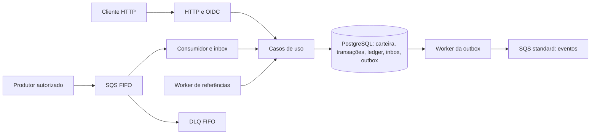
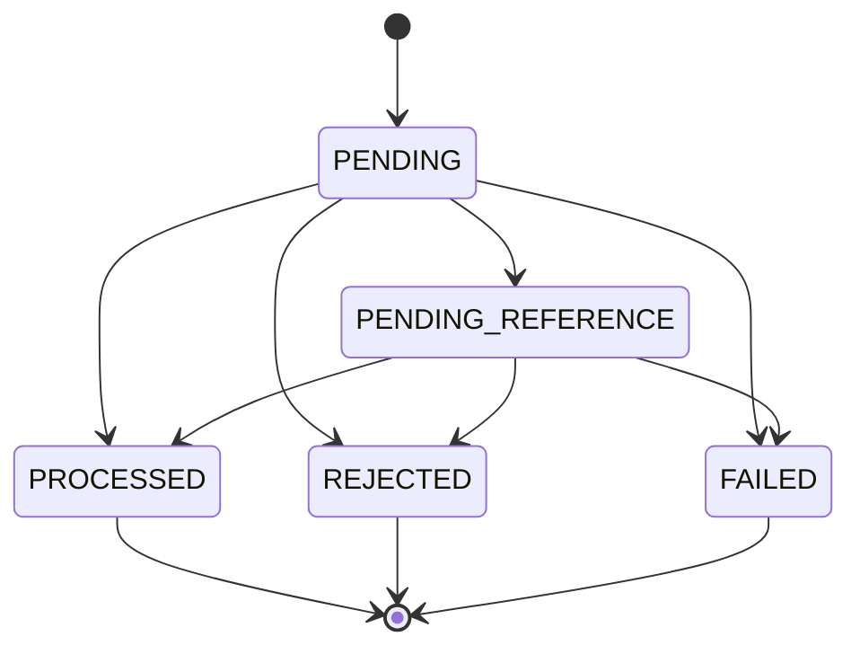

# Arquitetura

## Componentes e dependências

`internal/domain` contém dinheiro, carteira, transações, ledger e eventos.
`internal/application` coordena regras e transações por interfaces em
`ports`. Adaptadores HTTP, OIDC, PostgreSQL, SQS e workers ficam em
`internal/infrastructure`. `cmd/api` compõe os módulos com Uber Fx e
controla startup e shutdown. Um processo executa API e todos os workers;
não há binários separados para cada papel.

## Dinheiro e operações

Dinheiro é representado em centavos inteiros, com validação de moeda,
precisão e overflow; a API recebe e devolve strings decimais. As moedas
aceitas são BRL e USD. Uma carteira é única por jogador e moeda.

Money usa `int64` em centavos: o intervalo interno é
`-92233720368547758.08` a `92233720368547758.07`. Entradas externas aceitam
somente valores não negativos; BET/WIN/REFUND/ROLLBACK exigem valor positivo.
Parsing, soma, subtração e negação verificam overflow; negar MinInt64 falha.
Valores como `25`, `25.0`, `025.00` e `25.00` normalizam para `25.00`.
Não há arredondamento: mais de duas casas, expoentes, NaN, Infinity,
espaços e sinal negativo são rejeitados pelo parsing externo.

| Operação | Efeito |
| --- | --- |
| OPENING | Interna; saldo inicial positivo gera crédito, ledger e eventos; zero não gera movimento |
| BET | Débito, condicionado a saldo suficiente |
| WIN | Crédito; referência opcional a BET |
| LOSS | Valor zero; sem alteração de saldo, versão financeira ou ledger |
| REFUND | Estorna BET referenciado |
| ROLLBACK | Inverte o efeito de BET, WIN ou REFUND referenciado |

Referências são validadas no escopo do provedor, carteira, jogador, moeda e
rodada. O código atual não compara gameId ao resolver a referência.
Reversões exigem valor compatível com a origem e não podem
estornar a mesma transação duas vezes com sucesso. A reversão de um crédito
pode ser rejeitada se o saldo atual não permitir o débito. OPENING não é
aceita como operação externa.

Estados incluem PENDING, PENDING_REFERENCE, PROCESSED, REJECTED e FAILED.
Rejeições de negócio são persistidas com código de falha e evento, sem
movimento financeiro. Falha de infraestrutura aborta a transação do banco;
ela não é convertida automaticamente em rejeição financeira.

FAILED é suportado no domínio e na persistência, mas não é gravado pelo
fluxo atual ao esgotar falhas de transporte: mensagens permanentes vão para
a DLQ para auditoria e intervenção, sem commit financeiro parcial. Erros
transitórios provocam rollback e retry. Não há commit intermediário de
PENDING no caso de uso; a pendência confirmada é PENDING_REFERENCE, com
retomada durável pelo worker.

## Atomicidade, concorrência e idempotência

`UnitOfWork` abre uma transação PostgreSQL e entrega repositórios ligados
à mesma conexão transacional. Saldo, versão, transação de aposta, ledger,
inbox e eventos da outbox são confirmados juntos. Um erro provoca rollback.
Não há mutex em memória como garantia financeira entre processos.

A biblioteca escolhida é pgx/v5 com pgxpool e SQL explícito, para manter
locks, condições de versão e limites de transação verificáveis. Money é
mapeado para BIGINT de centavos e código de moeda; a reidratação usa
`MoneyFromMinorUnits` e não reaplica efeitos. Os repositórios recebem o
mesmo `pgx.Tx` da UnitOfWork; não iniciam commits financeiros independentes.

O processamento procura uma operação existente, bloqueia a carteira com
`SELECT ... FOR UPDATE` e repete a busca após adquirir o lock. Essa segunda
busca detecta uma operação confirmada enquanto outra instância aguardava.
A atualização da carteira também usa sua versão. Constraints e índices
únicos protegem identidades, vínculos financeiros e reversões.

Idempotência é definida por provedor e chave, com unicidade adicional por
provedor e ID externo. O hash SHA-256 do payload normalizado identifica
mudanças nos dados financeiros. Chave/identidade repetida com conteúdo
compatível devolve o resultado armazenado; conteúdo incompatível produz
conflito. O replay de uma operação terminal mantém o saldo registrado
naquela operação, mesmo que a carteira tenha mudado depois. Uma operação
pendente pode evoluir até um estado terminal.

O hash financeiro é SHA-256, codificado em hexadecimal, sobre o JSON
compacto produzido por `encoding/json` de uma estrutura com chaves em ordem
alfabética: externalTransactionId, gameId, kind, money (amount, currency),
playerId, providerId, referenceExternalTransactionId (omitido quando nil),
roundId e walletId. UUIDs usam a forma textual canônica e Money usa duas
casas; moeda e identificadores de negócio não recebem trim nem conversão
silenciosa de caixa. `idempotencyKey`, correlationId, causationId, messageId
e occurredAt ficam fora desse hash. HTTP e SQS constroem o mesmo input.
O hash da inbox é distinto: SHA-256 dos bytes exatos do envelope recebido.

HTTP e SQS usam a mesma lógica persistente. A garantia é de um único efeito
financeiro para uma identidade idempotente válida, inclusive após reinício;
não é uma promessa de entrega única de mensagens.

## Ledger e reconciliação

Cada movimento financeiro cria um lançamento com direção, valor, saldo
anterior e posterior. Triggers impedem UPDATE e DELETE do ledger. Abertura
positiva também é registrada. LOSS, rejeições e pendências não inventam
movimentações para representar estados de processamento.

A consulta pagina por `(created_at, id)` em ordem decrescente. Reconciliação
compara o saldo materializado da carteira com créditos menos débitos do
ledger e registra divergências. Ela é diagnóstica: não sobrescreve saldos.

## Inbox, retries e referências fora de ordem

O consumidor verifica o `SenderId` fornecido pelo SQS contra o mapa de
provedores autorizados e exige `MessageGroupId = walletId`. O JSON não é
fonte confiável de identidade. FIFO reduz concorrência dentro de um grupo;
os locks do banco continuam necessários para chamadas HTTP e processos
independentes.

A inbox usa nome do consumidor, `messageId` do envelope e hash dos bytes
recebidos. Registro, tratamento e conclusão da inbox ocorrem na mesma
transação financeira. O consumidor só chama `DeleteMessage` após commit.
Se cair entre commit e exclusão, a redelivery encontra o resultado salvo.
Reutilizar um ID de mensagem com bytes diferentes causa conflito.

Erros transitórios alteram a visibilidade com atraso exponencial limitado
a 60s. Erros permanentes liberam a visibilidade imediatamente e deixam o
broker aplicar redrive. Após cinco recebimentos, o SQS encaminha para a DLQ.
Rejeições financeiras e pendências de referência persistidas são confirmadas
normalmente; sua resolução não depende de reter a mensagem na fila.

Uma referência ainda inexistente ou não terminal produz PENDING_REFERENCE.
O worker consulta pendências no banco, coordena claims entre instâncias e
reavalia a operação. Tentativas e próximo instante são persistentes, com
backoff e limite configurável. Esgotar a espera por referência resulta em
REJECTED com `REFERENCE_NOT_FOUND`. Não existe polling infinito em memória.

## Outbox e falhas entre sistemas

Eventos são snapshots serializados gravados com o efeito financeiro. O
publisher reserva eventos com `SKIP LOCKED`, lease e token de posse; publica
fora da transação de claim e só confirma se ainda detém o token. Um dono
antigo não pode confirmar o trabalho de outro após expiração da reserva.

Uma queda antes do envio permite nova tentativa após o lease. Uma queda
após o envio e antes de gravar `published_at` permite publicação duplicada.
O evento mantém o mesmo `eventId`, que deve ser usado pelos consumidores
para deduplicação. Retries da outbox persistem tentativas e agenda com
backoff; não há limite terminal de tentativas configurado para publicação.

Eventos incluem `WagerTransactionProcessed`, `WagerTransactionRejected`,
`WagerTransactionPendingReference` e `WalletBalanceChanged`, com envelope versionado, aggregateId, occurredAt,
correlationId e causationId quando disponível. LOSS não gera evento de
mudança de saldo. Uma transação com efeito financeiro gera evento de
processamento e evento de saldo.

## Autenticação e policies

HTTP usa discovery OIDC e introspecção de tokens no Keycloak. O startup
confere issuer, endpoint e credenciais; cada autenticação valida os claims
esperados e os papéis do cliente `wagering-api`. Acesso interno e acesso de
provedor são distintos. Consultas de transações respeitam o provedor
autenticado. Indisponibilidade de autenticação não libera acesso.

No startup, adaptadores SQS validam atributos FIFO, redrive para DLQ,
`maxReceiveCount=5`, policies explícitas e RedriveAllowPolicy restrita à
fila fonte. O provisionamento local usa o principal da conta fictícia
LocalStack. Isso verifica a configuração das filas, mas não equivale a uma
auditoria completa de IAM da AWS: roles, identity policies, condições,
SCPs e permissões efetivas precisam de validação no ambiente real.

## Observabilidade e limites de interpretação

Logs JSON carregam contexto como correlationId, IDs financeiros e resultado.
`/health/live` verifica o HTTP; `/health/ready` consulta PostgreSQL e SQS.
O readiness não revalida continuamente todas as dependências, como OIDC.
`/metrics` é público e expõe contadores locais ao processo, reiniciados
quando ele reinicia. Colete cada réplica individualmente.

| Métrica | Significado |
| --- | --- |
| `wager_results_total{status}` | Resultados observados em HTTP, SQS e tentativas confirmadas do worker de referências |
| `wager_duplicates_total{source}` | Uma observação por replay, no label idempotent_replay |
| `wager_retries_total{reason}` | Decisões de retry do consumidor e do worker de referências |
| `wager_dlq_redrive_decisions_total{reason}` | Decisões de deixar uma entrega para redrive; pode repetir a mesma mensagem |
| `wager_dlq_messages` | Gauge de mensagens visíveis, em voo e atrasadas na DLQ, reportadas aproximadamente pelo SQS |
| `wager_concurrency_conflicts_total{scope}` | Conflitos detectados nos caminhos instrumentados; não mede tempo de espera por lock |
| `outbox_publish_results_total{result}` | Resultados das tentativas de publicação |
| `outbox_publish_retries_total{attempt}` | Retries da publicação por tentativa |
| `outbox_claim_failures_total` | Falhas ao reservar evento |
| `outbox_lag_seconds` | Tempo desde ocorrência até tentativa de publicação, incluindo retries |
| `wager_processing_latency_seconds` | Latência observada nos adaptadores instrumentados |
| `wallet_reconciliation_divergences_total` | Reconciliações que encontraram diferença |

As durações expõem count, sum e max; não oferecem percentis. O lag não mede
a idade do evento mais antigo ainda parado na outbox. Resultados incluem
replays e tentativas de referência, portanto não são uma contagem de
transações únicas. Conflitos HTTP/SQS/referências usam a mesma classificação,
incluindo versão da carteira, idempotência, inbox, deadlock e serialização.
O gauge da DLQ é atualizado a cada readiness bem-sucedido (o healthcheck do
Compose roda a cada 10s); antes da primeira leitura ele é omitido. Se a
consulta falhar, readiness falha e o gauge mantém a última amostra. A contagem
é aproximada, conforme o broker. Substitui a interpretação ambígua do antigo
`wager_dlq_total`, renomeado para explicitar decisões de redrive.

## Ciclo de vida e shutdown

Fx injeta dependências por construtores e valida configuração e conexões
antes de aceitar tráfego. Os hooks param em ordem inversa à inicialização:
o HTTP deixa de aceitar entradas e espera handlers, os workers são cancelados
e aguardados, e os pools/transports fecham depois de seus usuários.
As requisições HTTP têm prazo de 10s; operações dos workers usam os prazos
configurados. No cancelamento, transações são revertidas; o consumidor tenta
liberar visibilidade usando um contexto de limpeza e a outbox permite que
o lease expire para outra instância retomar. O Compose concede 30s ao shutdown.

## Evidências e trabalho restante

Os testes com três processos validam as duas apostas de 80 sobre saldo 100,
50 duplicatas concorrentes, replay em novos processos e progresso de outras
carteiras enquanto uma permanece bloqueada. Cada filho abre seu próprio pool
e aguarda uma barreira antes de operar. São testes do caso de uso com banco
real; não simulam um balanceador de produção. Os testes HTTP/SQS, estornos,
referências e interrupção complementam esses cenários.

A execução Compose validou migrations, prontidão, autenticação, abertura e
publicação da outbox. As fixtures integradas provisionam policies e redrive
restrito e compõem a dependência de métricas. Os comandos de validação com
race detector e simulações de falha estão no README.

Não há balanceador, autoscaling, persistência local do broker nem automação
de infraestrutura AWS nesta entrega. A porta fixa do serviço app exige
override/balanceamento para escalar réplicas HTTP no mesmo host. O Dockerfile
usa build em múltiplos estágios, usuário sem privilégios e healthcheck; o
Compose é o ambiente local reproduzível, não uma configuração de produção.
